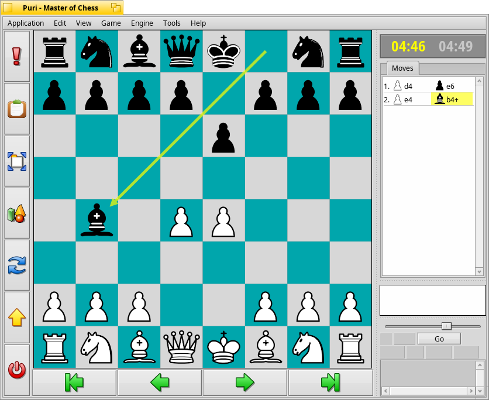

Puri
===========

Puri is a chess program to play offline or against somebody over the network. It uses the Stockfish chess engine.
Puri has timers, move records, good 2D graphics and also a 3D view to make the playing experience excellent.

Compiling Puri
===============

You need at least gcc4 to compile Puri. That means, if you are using a hybrid Haiku you need to run the command "setarch x86" first.
You can compile the program with "make" inside the "source" directory.
